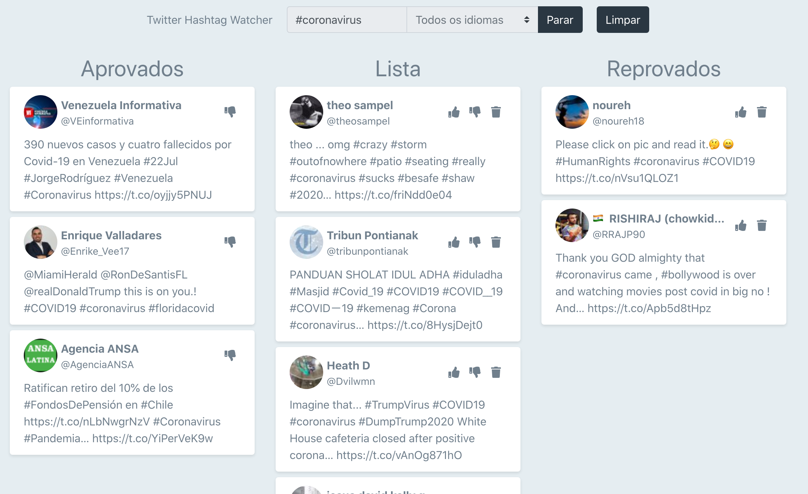
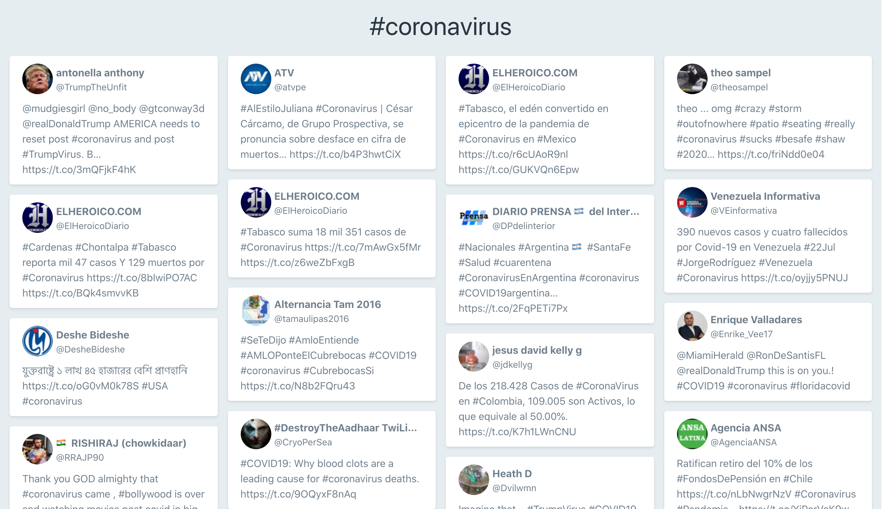

# Twitter Hashtag Watcher (Backend)

## Sobre o projeto

Essa aplicação foi criada para o processo seletivo da Globo.

O objetivo é criar um aplicação controle que receba tweets com determinada hashtag e que, após serem aprovados, sejam mostrados em um telão.

O frontend da aplicação foi feito em ReactJS, usando websockets para comunicação com o backend.

## Demo

A imagem a seguir mostra a tela de moderaçao dos tweets:

E essa é a visualização do telão.

## Primeiros passos

Antes de iniciar o servidor, edite o arquivo `.env-example` alterando a variável REACT_APP_SERVER para o endereço IP do backend. Após isso, renomeie o arquivo para `.env`.

### Instalação

Para instalar as dependências do projeto, basta rodar o seguinte comando:

Usuários de yarn:
`yarn`

Usuários de npm:
`npm install`

## Comandos

### Rodar servidor

Usuários de yarn:
`yarn start`

Usuários de npm:
`npm run start`

### Fazer a build do projeto

Usuários de yarn:
`yarn build`

Usuários de npm:
`npm run build`

Os arquivos da build serão salvos na pasta build.

### Rodar uma build do projeto

Se você quiser servir somente a build do projeto, use o comando:

Usuários de yarn:
`yarn serve`

Usuários de npm:
`npm run serve`
